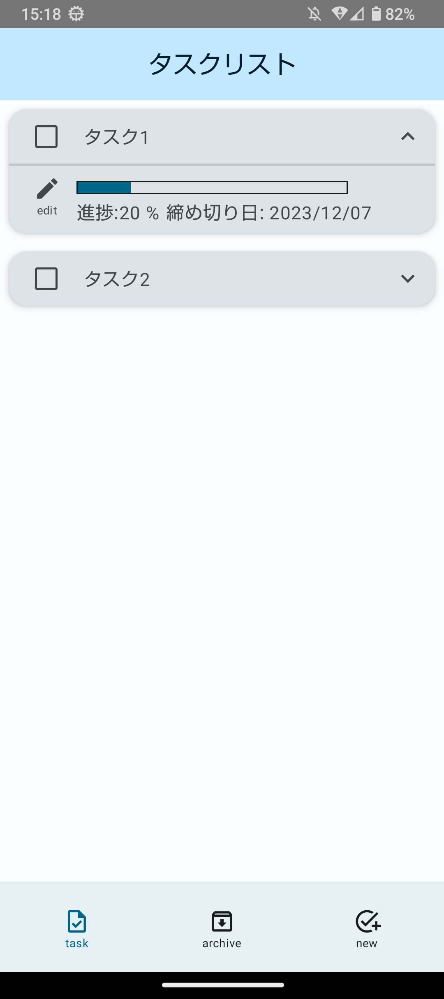
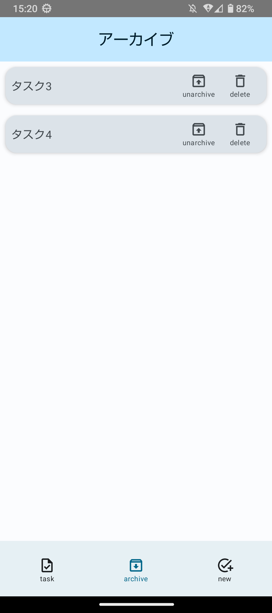
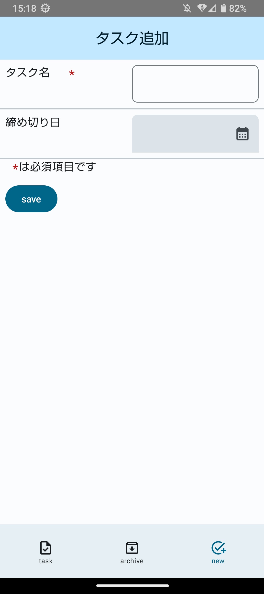
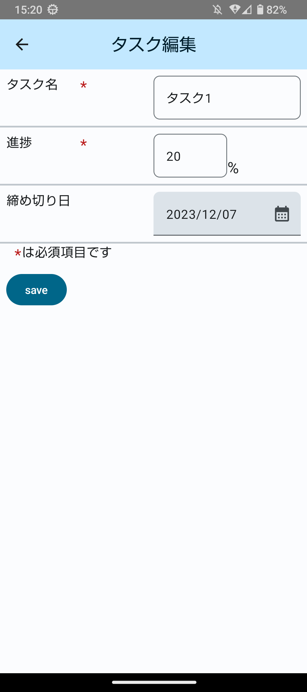

# android-compose-todo-application
このアプリはTodoリストです。初めて作成したAndroidアプリです。

## アプリ配信
[Google Play Store](https://play.google.com/store/apps/details?id=com.keinosuke.todoapplication)

>[!CAUTION]
>このコードにはリリース前の変更も含まれています。  

## 想定環境
使用言語: Kotlin  
Android Studio Hedgehog | 2023.1.1  
OS: Windows 11  
minSdkVersion: 26  
targetSdkVersion: 33  

## 機能説明
### タスク一覧画面
<p align="center">
  
</p>
<p align="center">
  図1. タスク一覧画面
</p>
<p align="center">
  
</p>
<p align="center">
  図2. 完了状態のタスクカード
</p>

タスク一覧画面です。この画面では、タスクが一覧表示されます。チェックボックスをタップすることでタスクの完了、未完了を切り替えることができます。editボタンをクリックするとタスク編集画面へ遷移します。タスクを完了状態にすると図2のようになり、archiveボタン、タスク完了日が新たに表示されます。archiveボタンをタップするとタスクはアーカイブ状態となり、タスク一覧画面では表示されなくなります。

### アーカイブ一覧画面
<p align="center">
  
</p>
<p align="center">
  図3. アーカイブ一覧画面
</p>

アーカイブ一覧画面です。この画面では、アーカイブ状態のタスクが一覧表示されます。unarchiveボタンをタップするとタスクは非アーカイブ状態となり、アーカイブ一覧画面では表示されなくなります。deleteボタンをタップするとタスクは削除され、タスク一覧画面でもアーカイブ一覧画面でも表示されなくなります。

### タスク追加画面
<p align="center">
  
</p>
<p align="center">
  図4. タスク追加画面
</p>

タスク追加画面です。タスクの内容を入力してsaveボタンをタップすることで新しいタスクが追加されます。

### タスク編集画面
<p align="center">
  
</p>
<p align="center">
  図5. タスク編集画面
</p>

タスク編集画面です。タスクの内容を入力してsaveボタンをタップすることでタスクの内容が更新されます。

## 使用ライブラリ
### Room
build.gradle(Module)
```
plugins {
    id 'com.google.devtools.ksp' version "1.8.21-1.0.11"
}

dependencies {
    def room_version = "2.5.0"
    implementation "androidx.room:room-runtime:$room_version"
    annotationProcessor "androidx.room:room-compiler:$room_version"
    ksp "androidx.room:room-compiler:$room_version"
    implementation "androidx.room:room-ktx:$room_version"
}
```
### ViewModel
build.gradle(Module)
```
dependencies {
    implementation "androidx.lifecycle:lifecycle-viewmodel-compose:2.5.1"
    implementation "androidx.lifecycle:lifecycle-viewmodel-ktx:2.5.1"
    implementation "androidx.lifecycle:lifecycle-viewmodel-savedstate:2.5.1"
}
```
### Navigation
build.gradle(Module)
```
dependencies {
    def nav_version = "2.5.3"
    implementation "androidx.navigation:navigation-fragment-ktx:$nav_version"
    implementation "androidx.navigation:navigation-ui-ktx:$nav_version"
    implementation "androidx.navigation:navigation-compose:$nav_version"
}
```

## 使用権限
このアプリで使用する権限はありません。
